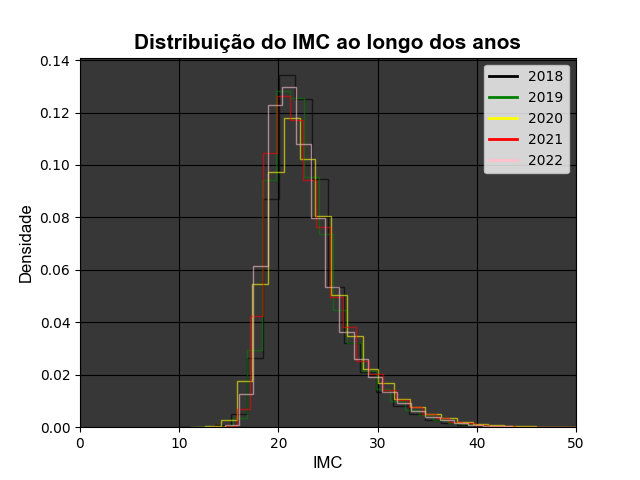
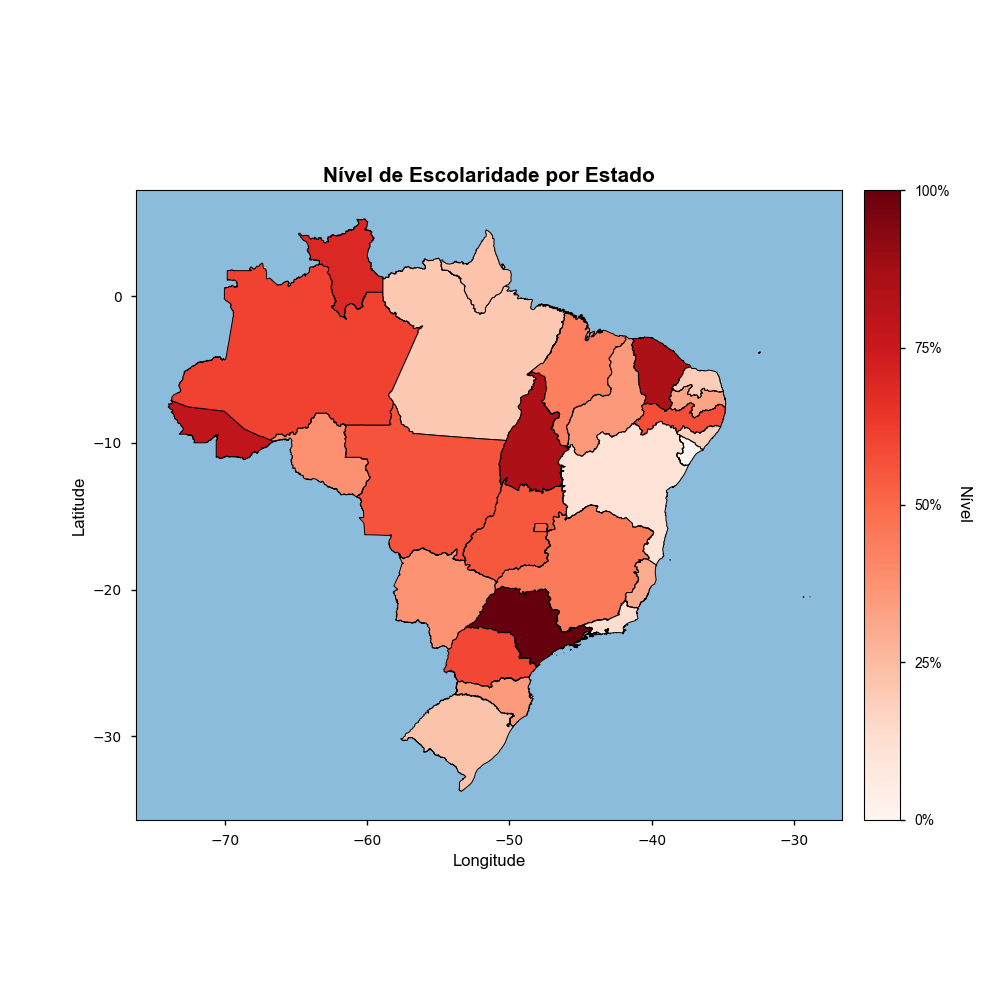
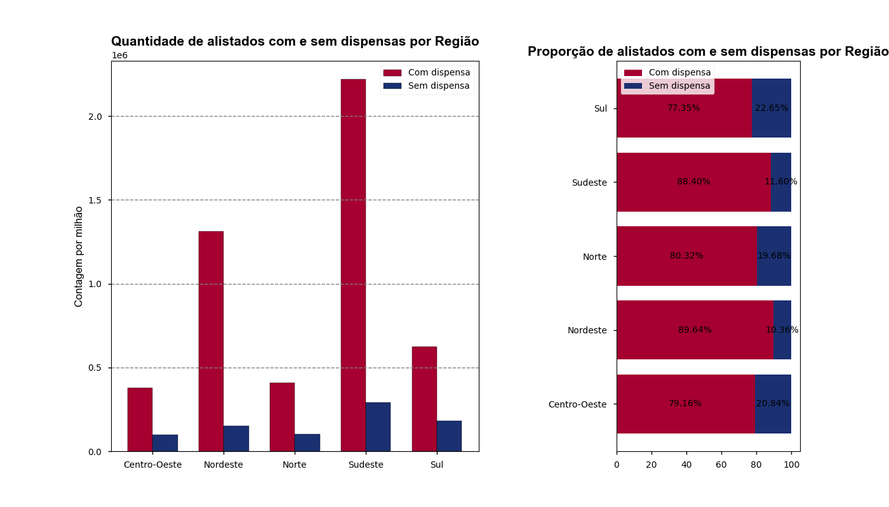
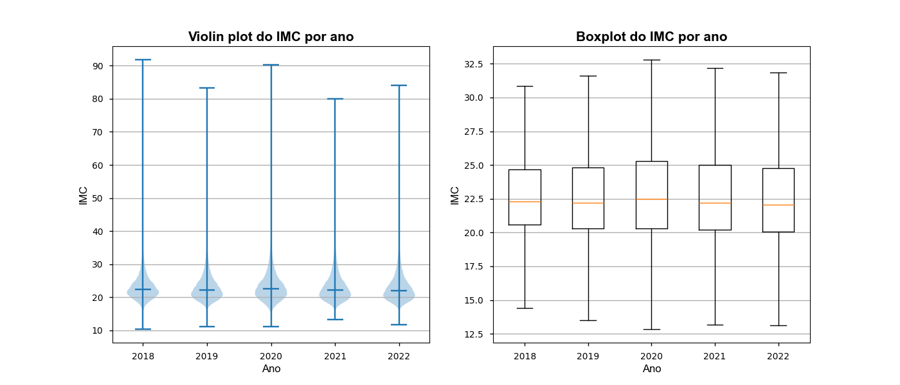

# Trabalho_A1_LP

Este projeto foi desenvolvido com base nos conjuntos de dados disponíveis no site de [Dados Abertos do Governo Federal](https://dados.gov.br/dados/conjuntos-dados/servico-militar).

## INFO DataBase
Dados dos cidadãos brasileiros residentes no Brasil e no exterior que se alistaram no Serviço Militar Obrigatório de 2007 a 2022 e relação das Juntas de Serviço Militar (JSM). Estão incluídas em todas as tabelas de dados do Serviço Militar as seguintes informações: ano de nascimento, peso, altura, tamanho da cabeça, número do calçado, tamanho da cintura, religião, município, UF e país de nascimento, estado civil, sexo, escolaridade, ano de alistamento, se foi dispensado ou não, zona residencial, município, UF e país de residência, junta, município e UF.

Visualização dos dados do Serviço Militar Obrigatório dos anos de 2018 a 2022, fornecidos pelo governo federal.

## Integrantes:
- [Anderson Falcão](https://github.com/falcaoanderson)
- [Kaiky Braga](https://github.com/kaikybraga)
- [Ramyro Corrêa](https://github.com/rcorreaa)
- [Samuel Lima](https://github.com/samucaaaaaa)

## Instruções:

1. Instalar os pacotes necessários: `pip install -r requeriments.txt` 
2. Descompactar apenas os arquivos `database_sermil_2018_2020.zip` e `database_sermil_2018_2020.zip` no diretório `dados/`.
3. Executar o arquivo `main.py`. As visualizações serão geradas no diretório `visualizacoes/`.

## Visualizações:

- Histograma IMC:

Ao longo do eixo X, podemos observar o Índice de Massa Corporal dos alistados, e, no eixo Y, podemos observar a distribuição dos IMCs em determinado intervalo. No total, temos 50 intervalos dos IMCs. Em cada ano, é possível verificar que a distribuição dos IMCs se aproxima de uma distribuição Gaussiana, com a média próxima de 20. É interessante notar que, no ano de 2020, a média deslocou-se levemente para a direita, e os IMCs ficaram levemente mais distribuídos (maior variância). É possível que tal fenômeno esteja relacionado com à Pandemia do COVID-19, que levou muitas pessoas a pararem de praticar atividades físicas regularmente. Após 2020, as distribuições voltaram a se comportar como no período pré-2020. Com isso, é possível concluir que, dadas condições regulares de rotina, a distribuição dos IMCs dos brasileiros de 18 anos tende a seguir uma distribuição Gaussiana com média próxima a 20.

- Mapa Alistamento:

Para criar a visualização, começamos gerando a tabela "tabela_escolaridade" usando a função "gera_tabela_escolaridade()". Essa tabela inclui a coluna "NIVEL_ESCOLARIDADE", que representa o nível de escolaridade normalizado para cada estado com a base nos dados do Alistamento Militar do Brasil no período entre 2018 e 2022. O gráfico é exibido em cores de gradiente, onde cores mais intensas indicam um nível de escolaridade mais elevado em comparação com outros estados. Na visualização exibida percebemos que São Paulo e Ceará sobresaem os outros estados, em contrapartida, estados como Sergipe e Bahia não tem destaque nesse quesito.

- Barras Alistamento:

O primeiro gráfico de barras oferece uma visão clara da distribuição regional dos alistados com e sem dispensa no Brasil nos anos de 2018 a 2022. Ele indica que em todas as regiões, a quantidade de dispensados é significativamente maior do que o número de pessoas que serviram o exército.
Pode-se notar que as regiões Sudeste e Nordeste são as áreas que concentram o maior número de alistados no Brasil. O Nordeste ultrapassa a marca de um milhão de alistados com dispensa, enquanto o Sudeste chega a superar a marca dos dois milhões de alistados com dispensa. Por outro lado, as regiões Centro-Oeste e Norte possuem as menores quantidades de alistados sem dispensa, e suas cifras são bastante semelhantes.
No segundo gráfico, a análise das porcentagens de alistados com e sem dispensa se destaca. A região Sul apresenta a maior proporção de alistados sem dispensa, com 22.65% do total, tornando-a a região com a maior taxa de alistados sem dispensa no país. Além disso, observa-se que as regiões Centro-Oeste e Norte têm uma ligeira diferença em relação ao número de alistados sem dispensa, com a Centro-Oeste apresentando uma quantidade maior em comparação à região Norte entre os alistados que serviram o exército.

- Violin/Boxplot IMC:

Nessa visualização queremos visualizar um resumo da distribuição do IMC entre os anos de 2018 e 2022. No gráfico é possivel perceber que a distribuição pouco mudou entre esses anos, com o destaque sendo o ano de 2018 que teve o maior distância MinMax.

